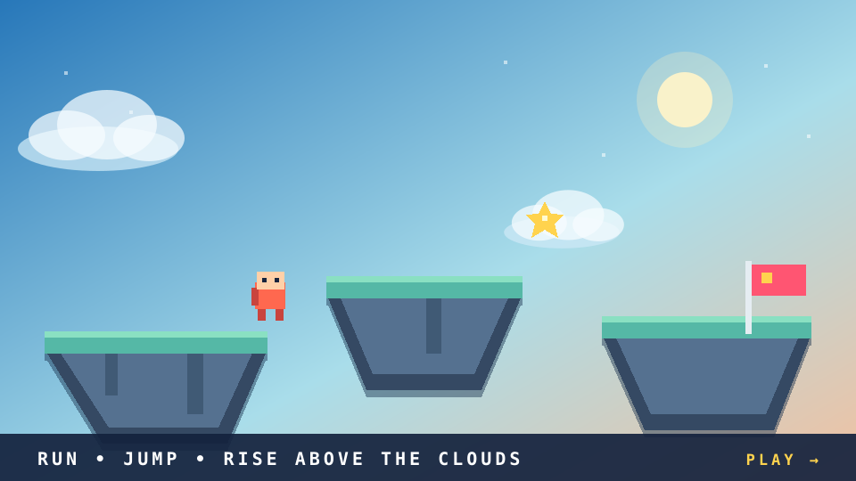
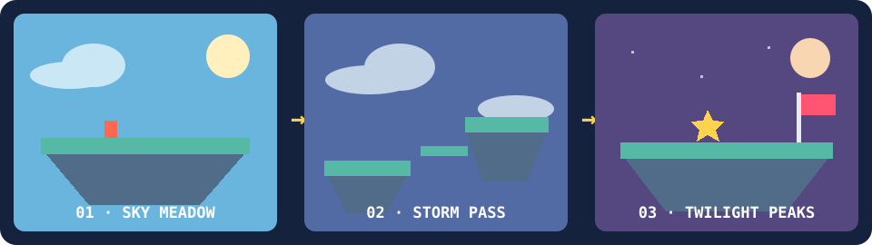

# Sky Hop

<div align="center">

<a href="https://tja0308.github.io/Sky-Hop/">
  
</a>

### A tiny adventure above the clouds

Cross ten floating-island levels, chase every star, and climb from clear blue
skies through lavender twilight to the Sunset Summit.

[](https://tja0308.github.io/Sky-Hop/)
[](https://github.com/TJA0308/Sky-Hop/actions/workflows/deploy.yml)
[](tests)
[](LICENSE)

[Play](https://tja0308.github.io/Sky-Hop/) ·
[How to play](#how-to-play) ·
[Explore the world](#explore-the-world) ·
[How it was built](#behind-the-clouds) ·
[Run locally](#run-it-locally)

</div>

> [!TIP]
> The animated scene above is illustrative pixel art built from Sky Hop's palette
> and game motifs. Click it—or any **Play** button—to launch the real game.

## Explore the world

<a href="https://tja0308.github.io/Sky-Hop/">
  
</a>

| 01 · Sky Meadow | 02 · Storm Pass | 03 · Twilight Peaks |
| :--- | :--- | :--- |
| Learn the rhythm of running, jumping, enemies, and spikes. | Time moving platforms and master the double jump. | Face Wisps, mixed hazards, and the final climb. |
| Levels 1–3 | Levels 4–6 | Levels 7–10 |

<details>
<summary><strong>See all ten levels</strong></summary>

| # | Level | Focus |
| ---: | --- | --- |
| 1 | First Steps | Movement, enemies, and introductory spikes |
| 2 | Gap Runner | Longer jumps and elevation changes |
| 3 | Spike Trail | Hazard timing and first checkpoint |
| 4 | Drift Platforms | Moving-platform boarding and dismounting |
| 5 | Double Jump | Midair jump pickup and vertical routes |
| 6 | Wind Crossing | Platforms, hazards, and checkpoint recovery |
| 7 | Wisp Hollow | Airborne enemies and double-jump gaps |
| 8 | Sky Fortress | Mixed enemies and vertical platforms |
| 9 | Final Approach | Full-mechanic challenge |
| 10 | Sunset Summit | Finale across every learned skill |

</details>

## How to play

Reach the flag to unlock the next level. Collect 50%, 80%, or 100% of a
level's stars to earn one, two, or three rating stars.

| Input | Action |
| --- | --- |
| **← / →** or **A / D** | Move |
| **Space**, **W**, or **↑** | Jump; hold for more height |
| Release, then press jump again | Double jump after collecting a sparkle |
| **Esc / P** or **Pause** | Pause |
| **R** during a level | Restart with a fresh score and three lives |
| **Enter** | Confirm or continue |
| **F** | Toggle fullscreen |

Touch controls appear automatically. Menus, pause, retry, completion actions,
and the selected map preview are tappable.

<details>
<summary><strong>Saved progress and starting over</strong></summary>

Progress is stored in the current browser. The live game and a local development
build have separate saves.

Choose **Restart Progress** from the title screen or world map, then select
**Confirm Restart Progress** in Settings. Unlocks, ratings, and best scores are
cleared; sound preferences remain. **Back / Cancel** or **Esc** keeps the save.

</details>

## What makes it hop

- **Ten handcrafted levels** generated from deterministic map definitions.
- **Four procedural skies** spanning daytime blue, high clouds, twilight, and sunset.
- **Responsive movement** with variable jump height, coyote time, and jump buffering.
- **Double jumps, moving platforms, checkpoints, Pufflings, and Wisps.**
- **Replayable progression** with unlocks, ratings, and browser-local best scores.
- **Procedural pixel art and Web Audio effects** with no downloaded art pack.
- **Keyboard and touch support** in a static game with no account or backend.

<div align="center">

[](https://tja0308.github.io/Sky-Hop/)

</div>

## Behind the clouds

Sky Hop was shaped through natural-language direction, generated implementation,
code review, and regression testing. One review found that valid jump geometry
alone was not enough: a collectible sat inside terrain, a checkpoint respawned
inside an island, ground enemies lacked gravity, and restarting could duplicate
points. Those findings became fixes and permanent tests.

<details>
<summary><strong>Architecture</strong></summary>

```text
src/
  scenes/       Boot, menus, world map, gameplay, and HUD
  entities/     Player, enemies, platforms, power-ups, and touch input
  utils/        Physics constants, procedural skies, saves, and sound
scripts/
  generate-levels.mjs    Source of truth for level geometry
  validate-levels.mjs    Jump, platform, entity, and patrol checks
public/assets/tilemaps/  Generated maps loaded by the game
tests/                   Save, physics, level, and scene regressions
docs/                    Development notes and release evidence
```

The game uses JavaScript, [Phaser 3](https://phaser.io/), and
[Vite](https://vite.dev/). Levels are authored in the generator and checked
against the same physics constants used at runtime.

</details>

<details>
<summary><strong>Quality and verification</strong></summary>

- The campaign has been manually played successfully.
- All ten generated levels pass geometry and entity-placement validation.
- 39 automated tests cover saves, resets, jump calculations, authored maps,
  attempt lifecycle, HUD state, and overlay transitions.
- Pull requests run lint, production build, tests, and map-drift checks.
- Pushes to `main` deploy the verified build to GitHub Pages.

Automated geometry remains an approximation of player skill and platform timing.
Every all-star route and every browser/device combination is not claimed as tested.

</details>

Read the [development case study](docs/development.md), the
[original level audit](docs/level-audit.md), or the
[release checklist](docs/release-checklist.md).

## Run it locally

Use **Node.js 22** and npm.

```bash
git clone https://github.com/TJA0308/Sky-Hop.git
cd Sky-Hop
npm ci
npm run dev
```

Open the address printed by Vite, usually `http://localhost:5173`.
On Windows PowerShell, use `npm.cmd` if execution policy blocks `npm.ps1`.

<details>
<summary><strong>Commands and contribution notes</strong></summary>

| Command | Purpose |
| --- | --- |
| `npm run dev` | Generate and validate maps, then start Vite |
| `npm run build` | Generate and validate maps, then build `dist/` |
| `npm run preview` | Serve the production build locally |
| `npm run lint` | Check JavaScript |
| `npm test` | Run all regressions |
| `npm run validate-levels` | Validate existing generated maps |

Edit level geometry in `scripts/generate-levels.mjs`; direct JSON edits are
overwritten. See [CONTRIBUTING.md](CONTRIBUTING.md) before opening a pull request.

</details>

## Project links

[Play Sky Hop](https://tja0308.github.io/Sky-Hop/) ·
[Changelog](CHANGELOG.md) ·
[Contributing](CONTRIBUTING.md) ·
[Report a bug](https://github.com/TJA0308/Sky-Hop/issues/new?template=bug_report.yml)

The build uses relative asset paths and deploys to the `gh-pages` branch.
Forks can enable **Settings → Pages → Deploy from a branch → gh-pages → / (root)**.

## License

[MIT](LICENSE). Phaser, Vite, and other dependencies retain their own licenses.
